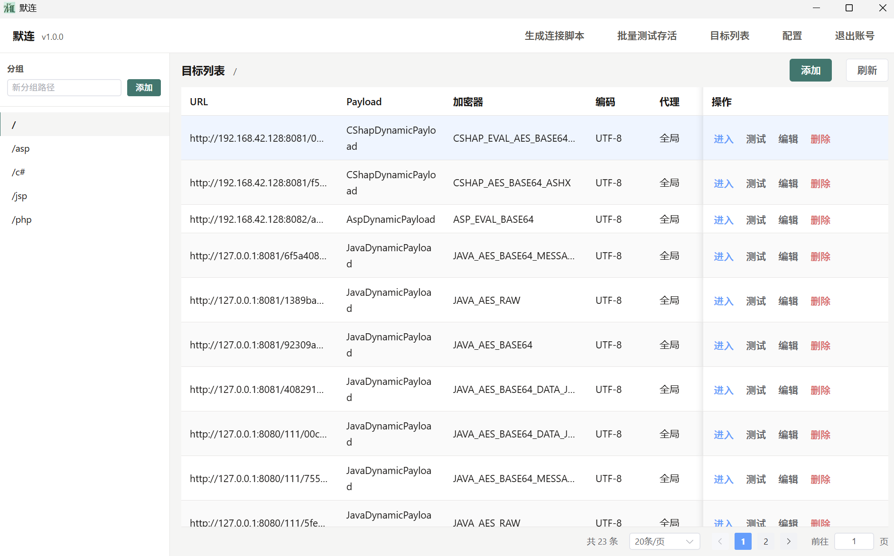
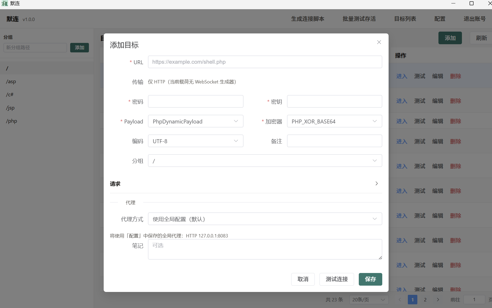
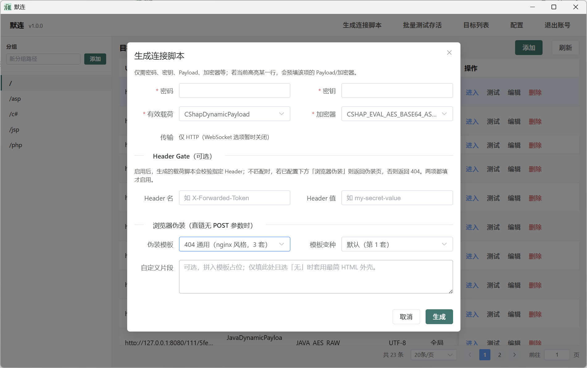
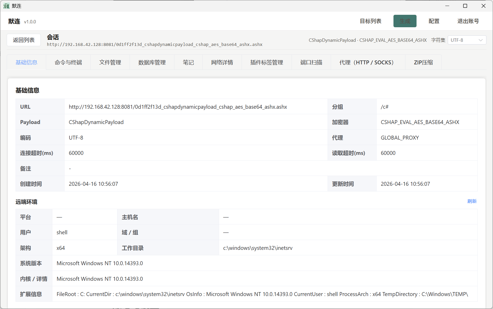
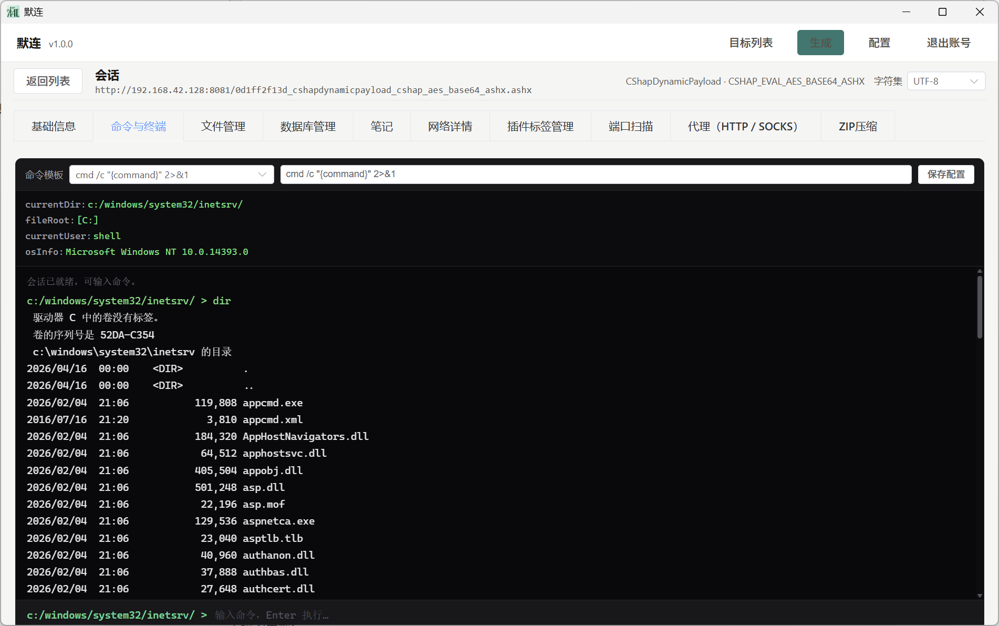
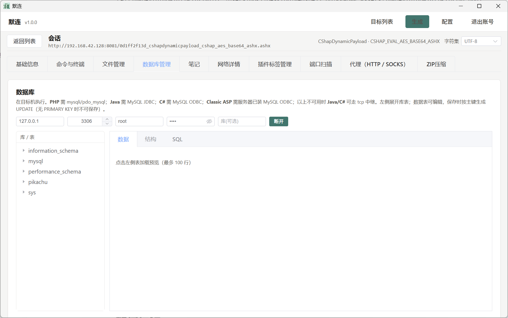
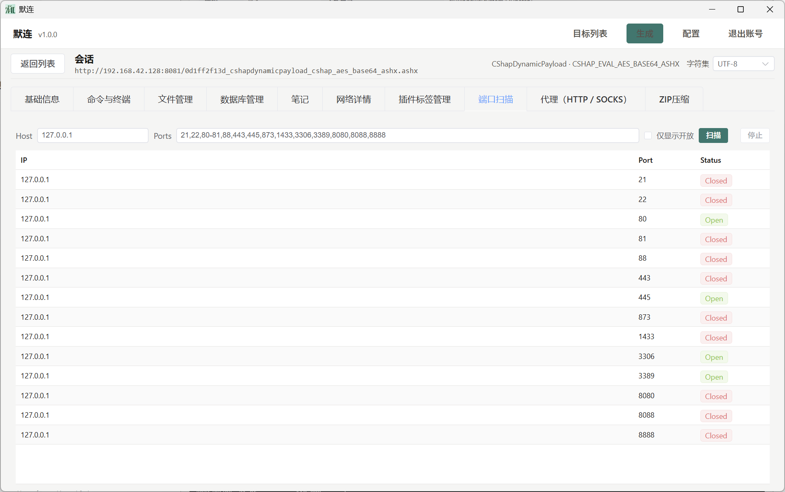
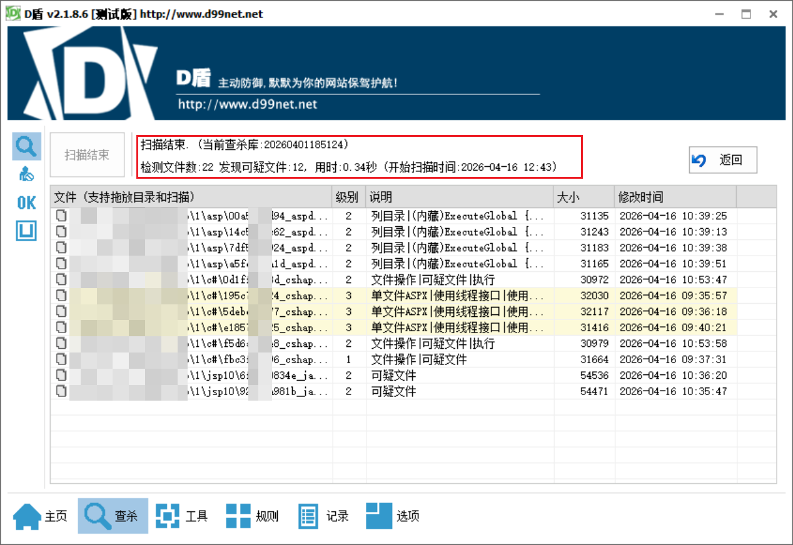
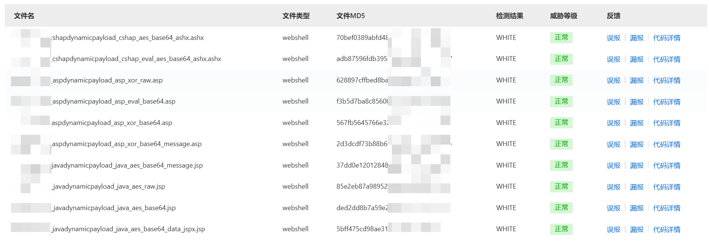

# 默连（morelian）

默连，面向 **Webshell ** 的目标管理与远程会话：本地保存配置、连接目标，并在会话中提供文件、命令、数据库及 Godzilla 兼容插件等能力。

**支持GUI运行，同时也支持后端运行，通过浏览器进行访问控制**



## 功能概览

### 目标与连接

- **分组与列表**：按路径式分组管理目标，支持分页、搜索与右键快捷操作。
- **存活检测**：单目标「测试连接」与导航栏「批量测试存活」（可后台进行）。
- **多协议握手**：按目标配置的 Payload、加密器与 URL 建立会话；会话内可切换 **UTF-8 / GBK** 等编码。
- **代理**：支持为单目标配置 HTTP / SOCKS 等代理类型（以界面与配置为准）。



### 载荷与生成

- **GenerateShell / 生成**：按密码、密钥、载荷类型、加密器生成服务端脚本；可配置 **Header Gate**（指定 Header 名与值）、**浏览器伪装**（模板与变种）、以及与 Tomcat 版本相关的 **javax / jakarta** 等选项。
- **连接脚本导出**：从目标列表生成/导出连接所需脚本（与导航「生成连接脚本」等入口配合）。



### 会话能力（标签页）

- **命令与终端**：统一执行命令、交互式终端等（合并原「执行 / 虚拟终端」等能力）。
- **文件管理**：远程文件浏览与操作。
- **基础信息**：会话与目标基础信息展示。
- **笔记**：会话侧笔记。
- **数据库**：数据库相关操作面板。
- **网络**：如 `netstat` 等网络信息查看。
- **标签管理**：自定义标签顺序与显示，支持「复制标签配置」等。



### 插件（按载荷与配置动态出现）

会话中可按插件类型懒加载，例如（不限于）：

- **压缩 / 端口扫描 / 代理合并 / 进程列表 / 枚举数据库连接**
- **屏幕、Servlet 管理、Jar 加载、FilterShell、PHP 工具、内存马**
- **PHP WebShell 扫描** 等

具体是否显示某插件取决于当前 **Payload 类型** 与内置实现策略







### 运行模式

- **桌面模式**：默认启动 Wails 窗口，数据存放在用户配置目录下的本地 **SQLite**。
- **Web 模式**：使用命令行 `-web` 在本地启动 HTTP 服务，用浏览器访问界面（适合仅需浏览器、或与其它工具联动）。监听地址可省略（默认 `127.0.0.1:34116`），也可传入端口或完整 URL。

## 如何运行

### GUI运行

直接双击就行

### Web 模式（浏览器）

在已构建的可执行文件或开发构建上，使用例如：

```bash
# 默认监听 127.0.0.1:34116
./morelian -web

# 指定端口
./morelian -web 8801

# 或使用 -web= 形式
./morelian -web=:8801
```

Windows 下将 `./morelian` 换成 `morelian.exe` 即可。

## 测试效果

### D盾效果：

php 所有版本无感，但是其余版本还是会警告，下一版本优化



### 阿里云效果:

借助ai，目前感觉还是很哇塞的



## 免责声明

本项目仅供安全研究、授权测试与教育用途。使用者须遵守所在地法律法规，仅在取得明确授权的前提下使用；因使用不当造成的后果由使用者自行承担。
